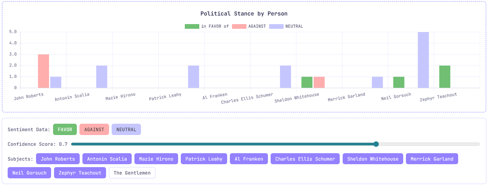
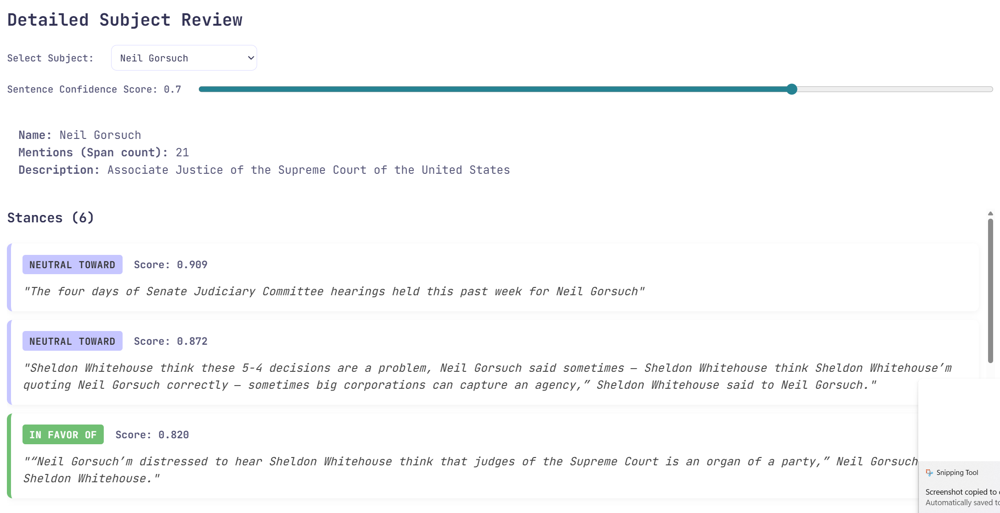

# Political Target-Based Stance Detection

**Author:** Sergio Rojas-Aguilar  
**DEMO**: ./DEMO_Version1.0.zip     
**Presentation**:  https://youtu.be/vAezXmZSj3s 

---

  

## Abstract
This project presents an end-to-end Natural Language Processing pipeline designed to detect, quantify, and visualize targeted political bias in news media. Where traditional sentiment analysis often fails when applied to journalism because it scores the overall emotional mood of a sentence rather than the author’s stance toward a specific political figure. This project aims to solve this with a pipeline integrated Coreference Resolution to preserve context, Named Entity Recognition and Entity Linking to disambiguate aliases using Wikidata, and Zero-Shot Natural Language Inference for subject dependent Stance Detection. To overcome the "Dilution Effect" where neutral background journalism flattens averaged stance scores that is drowned out the underlying bias signal. The system exposes the data through an interface. Features a visualize per subject bias and neutrality, allowing individuals to dial in their own thresholds via a confidence level slider and subject filters.

## Introduction
The goal of this project is to build an NLP pipeline that detects, quantifies, and visualizes political bias in news media by analyzing how different articles portray the same political entities. The core problem in computational bias detection is that standard sentiment analysis evaluates the mood of a sentence rather than the author's stance. For example, if a journalist writes about 'The Mayor’s opponent is an absolute disaster' a basic model scores that as negative sentiment, but misses the fact that the author is actually taking a positive stance toward the subject the Mayor.

To resolve this, the project moves away from basic emotion detection to Target Based Stance Detection. The pipeline that can identify political figures, resolves ambiguous pronouns back to those figures, links them to a universal knowledge base to resolve aliases, and calculates whether the author is taking a favorable, against, or neutral stance toward them. The resulting data is then visualized in an interactive dashboard, allowing users to map media bias computationally.

## Related Work
The architecture of this pipeline builds upon several key areas of NLP research:

* **Coreference Resolution:** NLP models struggle with ambiguous pronoun resolution, which is critical for maintaining subject context. Mohan and Nair (2019) demonstrated that BERT based approaches combined with classification models significantly improve the matching of expressions to their corresponding entities.
* **Entity Disambiguation:** Named Entity Disambiguation (NED) is vital for linking text to multi modal language models. As Duan et al. (2023) highlight, tracking subjects across texts requires robust Entity Linking to resolve synonymy and polysemy.
* **From Sentiment to Stance:** While Aspect based Sentiment Analysis (ABSA) is popular for product reviews , it struggles with relational mapping and complex contextual dependencies in political texts. Nguyen et al. (2023) emphasize that Stance Detection is fundamentally more suited for opinion mining, as it determines an individual's explicit standpoint (in favor of or against) a specific topic, rather than general sentiment.

## Data
The project has three primary data sources to ensure scale and grounded truth accuracy:

  

* **AllSides Media Bias Ratings:** Provides established publisher orientation ratings for over 1,400 news outlets, serving as a baseline for selecting opposing articles.
* **BASIL (Bias Annotation Spans on the Informational Level):** A specialized dataset of 300 news articles organized into left, center, and right "triplets". It includes over 1,700 manual annotations for lexical and informational bias, used for validation.
* **MBIC (Media Bias Annotation Dataset):** A large scale dataset used to test the model's ability to identify biased versus neutral framing at the sentence level.
* **Preprocessing Constraints:** Transitioning from the clean BASIL dataset to "wild" copy-pasted web articles required robust text normalization to handle inconsistent case sensitivity, poor grammar, and slang.

## Methodology
The pipeline is hosted on a Python backend and processes text through four primary stages:

  

* **Context Preservation (Coreference Resolution):** The text is initially processed as a full document using fastcoref. This maps ambiguous pronouns (e.g., ‘he’ , ‘they’, ‘'the President') back to their root entities, returning clusters of character indices.
* **Entity Extraction & Entity Linking:** The pipeline uses spaCy (en_core_web_trf) to identify “PERSON” entities. To resolve alias collisions (e.g, "Donald Trump" vs. "DJT"), the spacy-entity-linker plugin connects entities to a localized SQLite Wikidata knowledge base.
* **Target-Dependent Stance Detection:** The pipeline relies on a Zero-Shot Natural Language Inference (NLI) model, `MoritzLaurer/DeBERTa-v3-large-zeroshot-v2.0`. Sentences are processed individually. The model is fed the sentence as the premise and a hypothesis in the format: "The author of this text is {{in favor of/against/neutral toward}} {target_name}." 
* **User Driven Thresholdings:** Where the massive volume of neutral background journalism mathematically drowns out the underlying bias signal. The system avoids flat averages by instead, exposes all Stance Model Confidence and Stance Intensity. Rather than hardcoding a strict less than 0.70 confidence threshold(by default), this data is exposed through an interactive interface. This interface allows users to dial in their own thresholds and adjust signal levels via a confidence level slider, visualizing the results on a dynamic chart. To ensure data integrity, the dashboard integrates subject filters to mitigate model hallucinations and features a sentence review panel for analysis.

## Results
By pivoting from Sentiment to Stance, the pipeline can more successfully quantify subject bias.

* **Metric Success:** The confidence threshold successfully dropped noisy, neutral background sentences, allowing the dashboard to plot clear "Favor" and "Against" signals for specific politicians.
* **UI Visualization:** The frontend features an interactive dashboard where users can adjust the confidence score slider to filter the data. Users can click into specific subjects to see the exact text spans that triggered the model's stance score.

  

* **Grammar Independence:** The system successfully demonstrated that an author can hold a negative stance against the grammatical object of a sentence just as easily as the subject. By evaluating all linked entities in a sentence for stance, the model captured relational criticism that earlier iterations missed.

  

## Discussion
Several significant technical hurdles were overcome during development:

* **Clean Data vs. "The Wild" (Text Normalization):** Transitioning from structured, clean datasets (like BASIL JSON) to raw, copy pasted web articles initially broke the early pipeline models. It became clear that a text normalization layer was required to handle unpredictable grammar, slang, and inconsistent case sensitivity before the text could even reach the transformers.
* **Entity Collision & Coreference Failures:** Coreference resolution proved particularly challenging when handling complex, subject sentences. For example, in the text, "Donald Trump's nominee to fill the late Justice Antonin Scalia's seat, Judge Neil Gorsuch," the coreference model incorrectly linked the subsequent pronouns to Antonin Scalia rather than the actual grammatical subject, Neil Gorsuch. Furthermore, the model also frequently struggled to link isolated last names back to their full names.
* **Entity Hallucinations:** Even after applying strict spaCy filters to only extract PERSON labels, the NER model occasionally hallucinated subjects. It would incorrectly return events, music bands, and movie titles as people. Because this lacked a simple global solution, it required strict downstream validation (user interaction) to adjust and drop the false entities after the model resolved the text.
* **The Mapping & Text Replacement Hurdle:** Solving entity resolution when two distinct names appeared within the exact same sentence span made text replacement a highly delicate, order dependent process. Initial attempts to map coreference clusters to Wikidata entities using fuzzy string matching proved completely unreliable. To solve this, the pipeline was reengineered to use mathematical character index overlaps bounding box checks to map text precisely.
* **Context Granularity:** Finally, building the architecture revealed a vital lesson regarding NLP context windows. Different models require entirely different scopes of data to function accurately: coreference resolution strictly requires document level context to link pronouns across paragraphs, while stance detection strictly requires sentence level context to ensure the bias signal is not diluted by surrounding text.

## Conclusion & Future Work
This project successfully proves that computational bias detection requires a multi model pipeline. Human language relies too heavily on assumed context and relational grammar for a single model to capture all of it accurately. By combining coreference, entity linking, and zero-shot stance detection, the system effectively visualizes media bias.

### Future Work:
* **Entity Expansion:** Extending the Named Entity Recognition from strictly PERSON to track bias against organizations (ORG), such as political parties, and geographical locations (GPE).
* **Live Data Integration:** Hooking the Python backend to a live news API to create a fully automated, real time dashboard that tracks shifting media bias across publishers daily.

## Bibliography
* Duan, S., Guang, Y., Bu, W., & Yang, J. (2023). A Survey of Named Entity Disambiguation in Entity Linking. *2023 3rd International Conference on Intelligent Communications and Computing (ICC)*, 296-303. https://doi.org/10.1109/ICC59986.2023.10421092
* Mohan, M., & Nair, J. J. (2019). Coreference Resolution in Ambiguous Pronouns Using BERT and SVM. *2019 9th International Symposium on Embedded Computing and System Design (ISED)*, 1-5. https://doi.org/10.1109/ISED48680.2019.9096245
* Nair, R., Prasad, V. N. V., Sreenadh, A., & Nair, J. J. (2021). Coreference Resolution for Ambiguous Pronoun with BERT and MLP. *2021 International Conference on Advances in Computing and Communications (ICACC)*, 1-5. https://doi.org/10.1109/ICACC-202152719.2021.9708203
* Nazir, A., Rao, Y., Wu, L., & Sun, L. (2022). Issues and Challenges of Aspect-based Sentiment Analysis: A Comprehensive Survey. *IEEE Transactions on Affective Computing*, 13(2), 845-863. https://doi.org/10.1109/TAFFC.2020.2970399
* Nguyen, V., Zhang, X., & Colarik, A. M. (2023). A Research Pathway for Stance Detection in Speech. *2023 Global Conference on Information Technologies and Communications (GCITC)*, 1-8. https://doi.org/10.1109/GCITC60406.2023.10659745